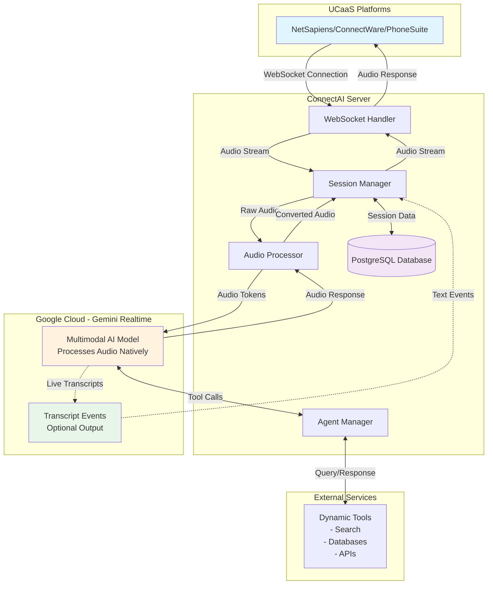
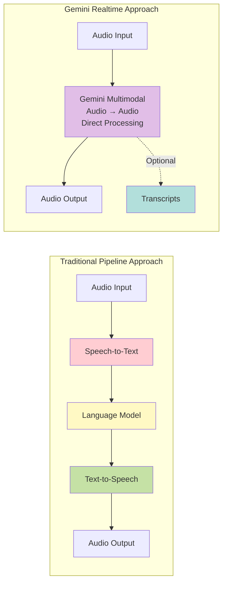
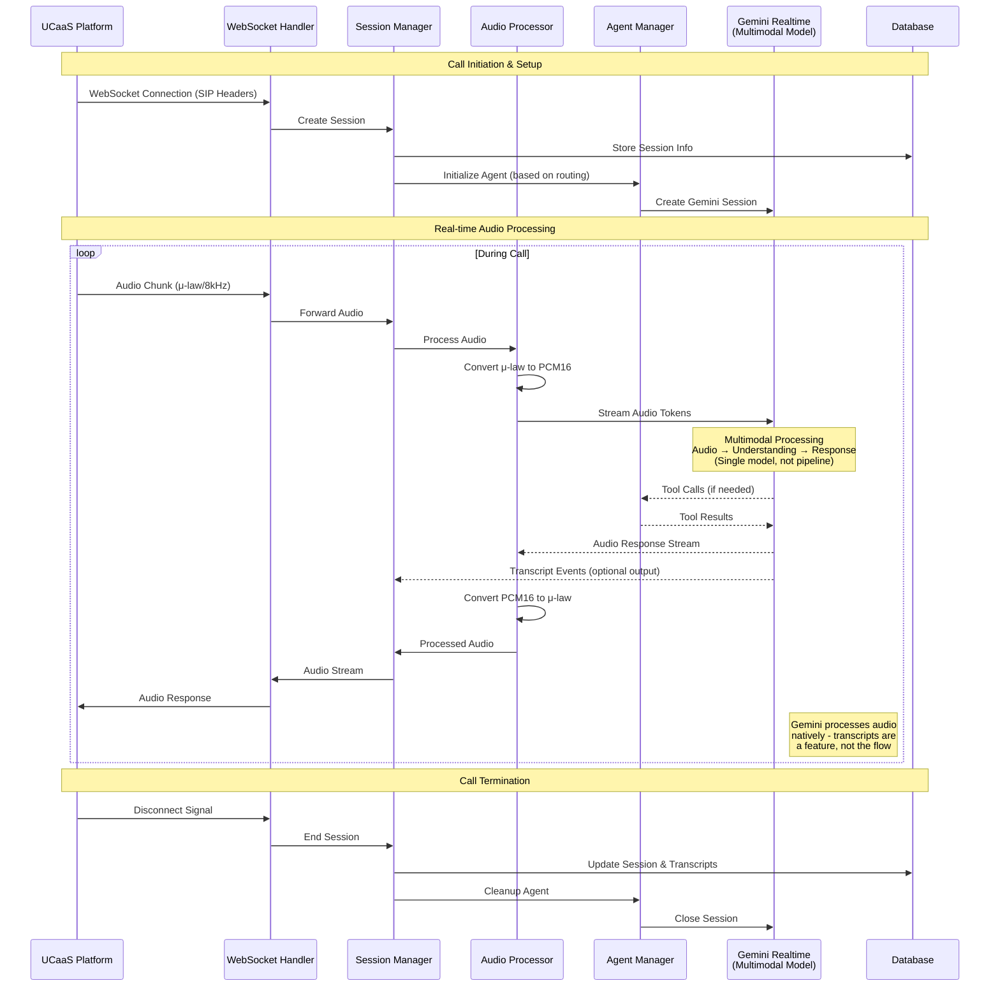
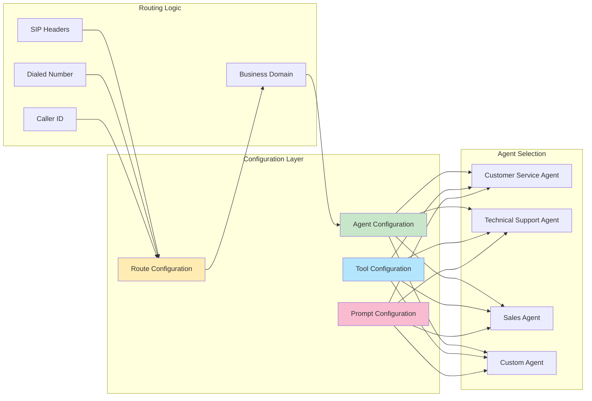
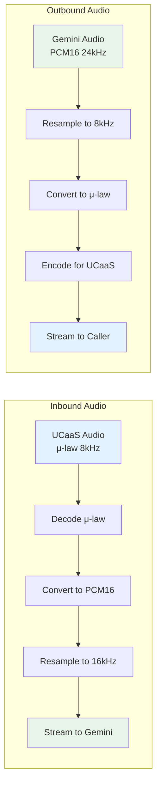
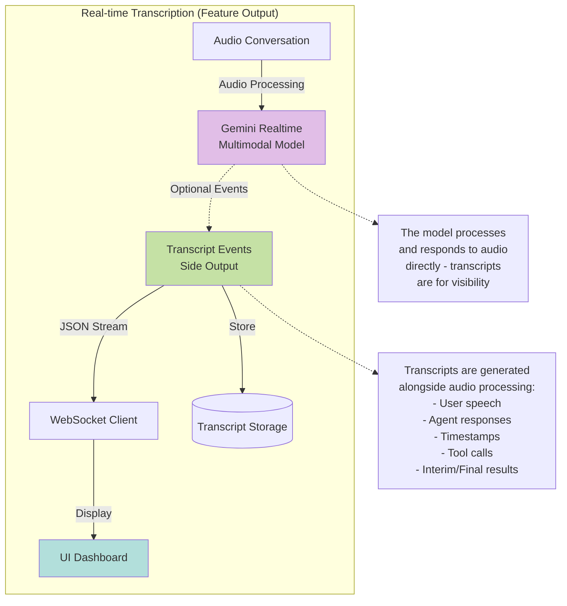
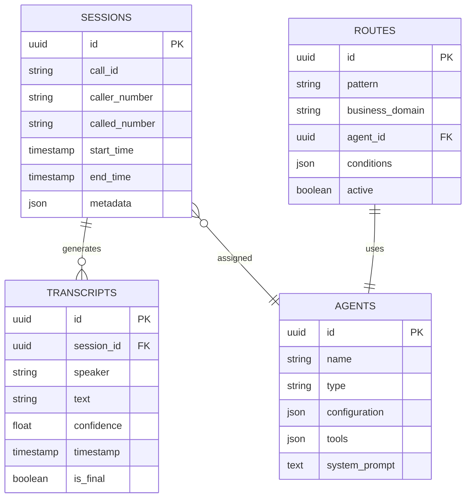
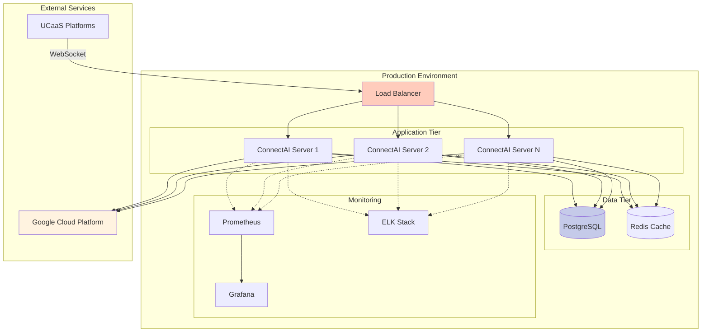

# ConnectAI Server Architecture

## Overview
ConnectAI is an AI-powered voice interaction system that integrates with UCaaS (Unified Communications as a Service) platforms to provide intelligent, real-time call handling with dynamic agent configuration.

## High-Level System Flow



## How Gemini Realtime Differs from Traditional Voice AI



### Key Differences:
- **No Pipeline Latency**: Audio is processed as audio, not converted to text and back
- **Natural Conversation**: Understands tone, emotion, interruptions, and overlapping speech
- **Audio-Native Reasoning**: The model "thinks" in audio tokens, preserving nuance
- **Transcripts as Features**: Text transcripts are generated for monitoring/logging, not as part of the processing flow

## Detailed Component Interaction



## Dynamic Configuration System



## Audio Processing Pipeline



## Live Transcription Flow



## Database Schema



## Key Features for Product Managers

### 1. **Dynamic Agent Configuration**
- Agents can be configured per business domain
- Custom prompts and personalities
- Tool access control (search, databases, APIs)
- Real-time configuration updates without restarts

### 2. **Multi-Platform Support**
- NetSapiens integration
- ConnectWare compatibility
- PhoneSuite support
- Extensible for other UCaaS platforms

### 3. **Real-time Capabilities**
- Live call transcription
- Instant AI responses
- Stream processing (no recording needed)
- Low-latency audio processing

### 4. **Business Intelligence**
- Call analytics and metrics
- Transcript storage and search
- Agent performance tracking
- Custom reporting capabilities

### 5. **Scalability**
- Microservices architecture
- Horizontal scaling support
- Load balancing ready
- Cloud-native design

## Technical Integration Points

### For VoIP Developers

1. **WebSocket Protocol**
   - Standard WSS connection
   - SIP header passthrough
   - Binary audio frames
   - JSON control messages

2. **Audio Formats**
   - Input: μ-law 8kHz (standard telephony)
   - Processing: PCM16 16kHz/24kHz
   - Output: μ-law 8kHz
   - Real-time conversion

3. **API Endpoints**
   ```
   POST /api/sessions/create
   GET  /api/sessions/{id}/transcript
   POST /api/agents/configure
   GET  /api/metrics/calls
   ```

4. **Event Streams**
   - Call start/end events
   - Transcription events
   - Agent action events
   - Error notifications

## Deployment Architecture



## Benefits Summary

### For Product Managers
- **Reduced Call Center Costs**: AI handles routine inquiries
- **24/7 Availability**: No human agent limitations
- **Consistent Service**: Standardized responses
- **Scalability**: Handle unlimited concurrent calls
- **Analytics**: Deep insights into customer interactions

### For VoIP Developers
- **Standard Protocols**: WebSocket, SIP, RTP compatible
- **Easy Integration**: RESTful APIs and webhooks
- **Format Agnostic**: Handles multiple audio codecs
- **Real-time Processing**: Sub-second latency
- **Debugging Tools**: Comprehensive logging and monitoring

## Understanding the Multimodal Architecture

### What Makes This Different

Unlike traditional voice AI systems that chain together separate STT → LLM → TTS services, Gemini Realtime is a **single multimodal model** that:

1. **Processes Audio Natively**: The model receives audio tokens and generates audio tokens directly
2. **Maintains Audio Context**: Understands interruptions, tone, pace, emotion without converting to text
3. **Reasons in Audio Space**: The AI's "thinking" happens in the audio domain, not text
4. **Provides Transcripts as Output**: Text transcripts are generated for human visibility, not for processing

### Live Transcript Feature

The system provides real-time transcripts as a **monitoring feature**:

1. **Parallel Generation**: Transcripts are generated alongside (not before) audio responses
2. **WebSocket Distribution**: Transcript events stream to connected clients
3. **Dual Output**: Both interim (partial) and final transcripts for real-time display
4. **Rich Metadata**: Includes timestamps, tool calls, and conversation turns
5. **Storage**: All transcripts saved to database for compliance and analytics
6. **API Access**: REST endpoints to fetch historical transcripts

This enables:
- Live monitoring of ongoing calls
- Real-time coaching capabilities
- Compliance recording
- Quality assurance
- Customer insight gathering

### Technical Implications

For VoIP developers, this means:
- **Lower Latency**: No STT/TTS conversion delays (~300-500ms faster)
- **Better Interruption Handling**: Natural conversation flow with barge-in support
- **Preserved Audio Nuance**: Emotion and tone inform responses
- **Simplified Architecture**: One model instead of three services
- **Consistent Voice**: No TTS voice selection needed

---

*This document provides a comprehensive overview of the ConnectAI server architecture. The system is designed to be modular, scalable, and easily configurable to meet various business needs while integrating seamlessly with existing UCaaS infrastructure.*